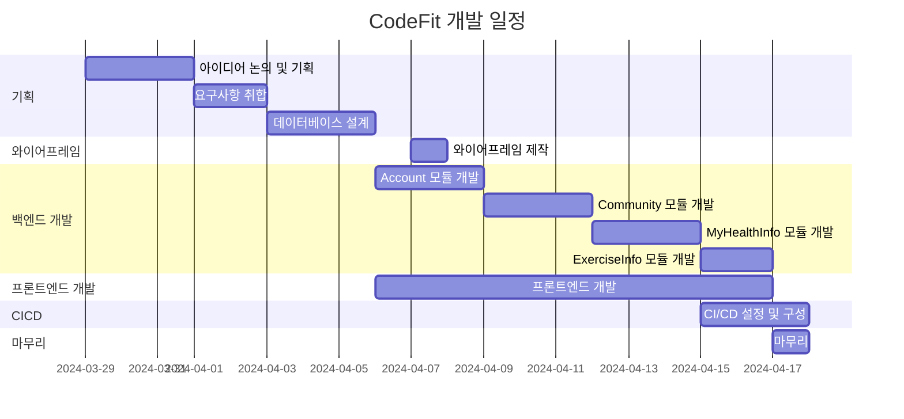
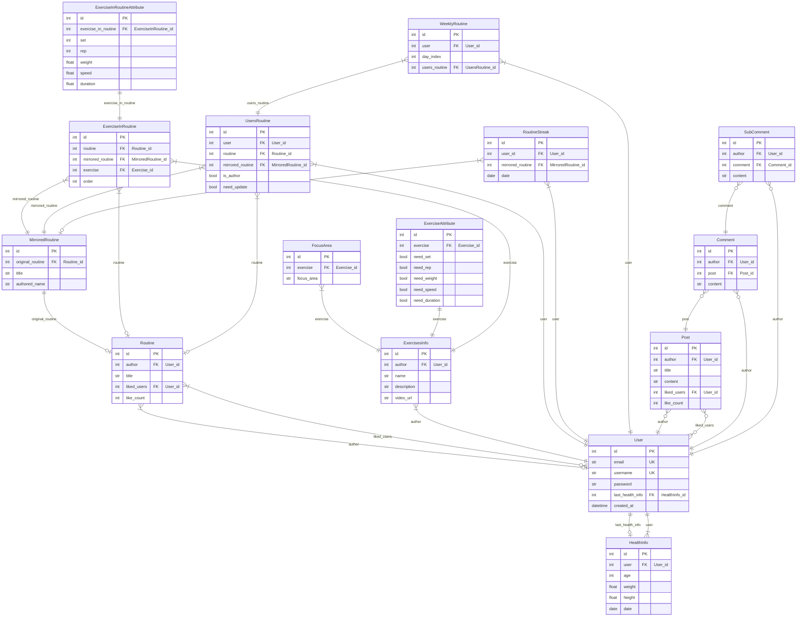

# 운동 도우미, 코드핏 (CodeFit)
>**"Codefit"은 코드(Code)와 피트니스(Fitness)의 결합으로, 소프트웨어 개발과 피트니스의 융합을 의미합니다. <br>
프로그래밍과 운동이라는 두 가지 다른 영역을 함께 생각하고, 조화롭게 결합하여 개인의 건강과 웰빙을 증진하는 것을 목표로 합니다. <br>
코드의 정확성과 효율성을 개발하며 동시에 건강한 신체를 유지하기 위한 운동을 통합하여, 개발자들이 건강한 라이프스타일을 유지하고 지속적인 성장을 이룰 수 있도록 돕는 개념입니다.**

### 💻 프로젝트 소개
>**Django Final Project** <br>
>**운동 도우미 웹, 앱 서비스입니다.** <br>
>**사용자는 자신의 운동 기록을 관리할 수 있으며 남들과 소통할 수 있습니다.** <br>
>**등록된 운동들을 조합해 자신만의 루틴 생성이 가능하며 공유할 수 있습니다.** <br>
>**사용자의 편의에 따라 특정 요일에 운동을 직접 배치해 사용자의 주간 루틴을 생성합니다.**

### 🧠 개발 동기
>**운동은 많은 사람들이 즐기는 활동이며, 팀원들도 운동을 즐기는 사람들이었습니다. <br>
또한, 팀장의 지인이 트레이너라는 점은 운동 코칭에 대한 직접적인 조언을 얻을 수 있는 좋은 기회가 될 수 있다 생각하였습니다.**

### 🕰 개발 기간
>**2024-03-29 ~ 2024-04-17**

### 👥 개발 인원
>**팀장 : 최지석** <br>
>**팀원 : 안효준, 이수현, 임빈**

### ✨ 구현 역할
>**팀장 : 최지석** <br>
>_요구사항 취합 및 정리_ <br>
>_Url Mapping 기초 설계_ <br>
>_CI & CD_ <br>
>_MyHealthInfo App_ <br>
>_ExercisesInfo App_

>**팀원 : 안효준** <br>
>_프로젝트 문서화_ <br>
>_Profile App_

>**팀원 : 이수현** <br>
>_fe 디자인 (Figma)_ <br>
>_와이어프레임_ <br>
>_Community App_

>**팀원 : 임빈** <br>
>_프로젝트 문서화_ <br>
>_ExercisesInfo App_

### 📌 기능
>**마이페이지** <br>
>_1. 로그인, 로그아웃, 회원가입, 회원탈퇴를 제공_ <br>
>_2. 프로필에서 사용자는 자신의 정보를 수정 가능_ <br>
>_3. 비밀번호 찾기 기능은 Email을 입력해 재설정 링크 발송_

>**커뮤니티** <br>
>_1. 게시글 생성, 수정, 삭제, 조회 가능_ <br>
>_2. 게시글의 댓글, 대댓글, 좋아요 기능_ <br>
>_3. 사용자 필요에 따라 첨부파일 추가_

>**운동 정보** <br>
>_1. 운동에 대한 정보 (운동명, 난이도, 운동부위 등..) 조회_ <br>
>_2. 해당 정보는 관리자만 수정 가능_

>**건강 정보** <br>
>_1. 사용자의 최근 건강 정보를 입력 및 조회 가능_ <br>
>_2. 사용자는 맞춤으로 운동 루틴이 생성 및 공유 가능_ <br>
>_3. 사용자가 최근 30일 본인의 식단을 기록 및 조회_

### 🔎 WBS
>**일정표는 머메이드로 작성**


### 🚀 사용 기술 스택
>**Frontend** <br>
  

>**Backend** <br>
  

>**InfraStructure** <br>
   

>**Project Management** <br>
   

### 🌐 Diagram
>**Entity-Relationship Diagram**


### 📏 와이어프레임
>**마이페이지** <br>
>마이페이지 클릭 시

>내 프로필

>친구 목록

>내 운동기록

>찜한 운동

>계정 탈퇴


>**운동 정보** <br>
>운동 정보 전체

>운동 정보 상세

>관련 운동 추천 상세


>**커뮤니티** <br>
>커뮤니티 전체

>커뮤니티 게시글

>커뮤니티 게시글 상세

>식단 공유 게시판

>운동 공유 게시판

>게시판 댓글

>게시판 대댓글

>게시판 대댓글 상세


### 💥 트러블슈팅
>**Django 테스트** <br>

>_모델 내용을 변경하지 않고, 그 모델을 참조하는 다른 모델 조회 시 불일치_ <br>
_모델을 변경시킬 때 마다 save()를 통해 변경하여 해결_

>_테스트 코드 내에서 patch, post의 응답을 기존 모델 인스턴스와 비교할 때 불일치_ <br>
_조회할 인스턴스의 refresh_from_db()를 사용하여 해결_

### 💭 프로젝트 회고
```
팀원으로써 이번 프로젝트를 진행하면서 소중한 경험을 쌓았습니다.
특히 팀장님의 역할을 통해 팀원과의 소통이 얼마나 중요한지를 더욱 명확하게 깨닫게 되었습니다.

팀장님은 각자의 능력과 역할을 고려하여 작업을 분배하고 문제가 발생할 때마다 적극적으로 의견을 수렴하고 해결책을 모색해주셨습니다.
이를 통해 프로젝트가 원활하게 진행되었고 팀원들 간의 협업도 더욱 강화되었습니다.

이번 프로젝트를 통해 기술적으로도 많이 성장할 수 있었습니다.

TDD를 처음 접하면서 요구사항을 명확하게 작성하고 코드를 작성하기 전에 테스트 케이스를 먼저 고려하는 중요성을 깨달았습니다.
이를 통해 코드의 품질을 높이고 유지보수성을 향상시킬 수 있었습니다.
그리고 코드의 추상화와 응답을 테스트하는 것이 코드의 유연성을 높이는 데에 도움이 되었습니다.

하지만 아쉬웠던 점도 분명 있었습니다.

TDD를 적용하면서 테스트 코드 작성과 실행에 많은 시간이 소요되었던 것이 아쉬웠습니다.
이로 인해 프로젝트의 진행 속도가 늦어지고, 완료에 영향을 미쳤습니다.
앞으로는 이러한 시간적 제약을 극복하고, 보다 효율적으로 TDD를 적용할 방법을 고민해봐야겠습니다.
```
