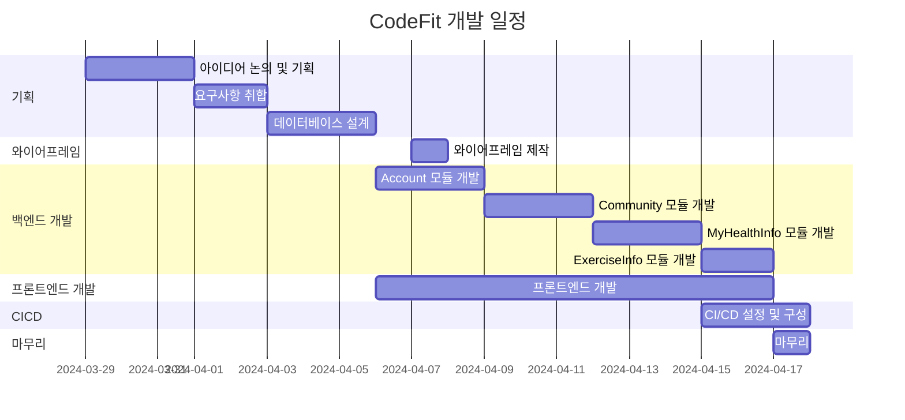

# 운동 도우미, 코드핏 (CodeFit)
>**"Codefit"은 코드(Code)와 피트니스(Fitness)의 결합으로, 소프트웨어 개발과 피트니스의 융합을 의미합니다.  
이는 프로그래밍과 운동이라는 두 가지 다른 영역을 함께 생각하고, 조화롭게 결합하여 개인의 건강과 웰빙을 증진하는 것을 목표로 합니다.  
코드의 정확성과 효율성을 개발하며 동시에 건강한 신체를 유지하기 위한 운동을 통합하여, 개발자들이 건강한 라이프스타일을 유지하고 지속적인 성장을 이룰 수 있도록 돕는 개념입니다.**

### 💻 프로젝트 소개
>**Django Final Project**  
>**운동 도우미 웹, 앱 서비스입니다.**  
>**사용자는 자신의 운동 기록을 관리할 수 있으며 남들과 소통할 수 있습니다.**  
>**등록된 운동들을 조합해 자신만의 루틴 생성이 가능하며 공유할 수 있습니다.**  
>**사용자의 편의에 따라 특정 요일에 운동을 직접 배치해 사용자의 주간 루틴을 생성합니다.**

### 🧠 개발 동기
>**운동은 많은 사람들이 즐기는 활동이며, 팀원들도 운동을 즐기는 사람들이었습니다.  
또한, 팀장의 지인이 트레이너라는 점은 운동 코칭에 대한 직접적인 조언을 얻을 수 있는 좋은 기회가 될 수 있다 생각하였습니다.**

### 🕰 개발 기간
>**2024-03-29 ~ 2024-04-17**

### 👥 개발 인원
>**팀장 : 최지석**  
>**팀원 : 안효준, 이수현, 임빈**

### ✨ 구현 역할
>**팀장 : 최지석**  
>_요구사항 취합 및 정리_  
>_Url Mapping 기초 설계_  
>_CI & CD_  
>_MyHealthInfo App_  
>_ExercisesInfo App_

>**팀원 : 안효준**  
>_프로젝트 문서화_  
>_Profile App_

>**팀원 : 이수현**  
>_fe 디자인 (Figma)_  
>_와이어프레임_  
>_Community App_

>**팀원 : 임빈**  
>_프로젝트 문서화_  
>_ExercisesInfo App_

### 🔎 WBS
>**일정표는 머메이드로 작성**

### 🚀 사용 기술 스택
>**Frontend**  
  

>**Backend**  
  

>**InfraStructure**  
   

>**Project Management**  
   

### 🌐 Diagram
>**Entity-Relationship Diagram**

