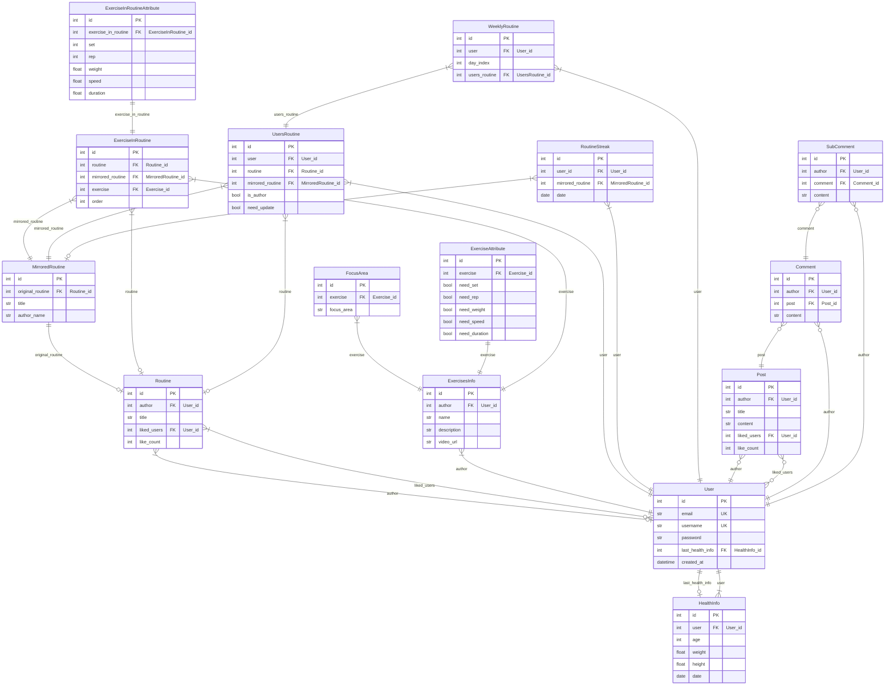

# Entity Relationship Diagram

```mermaid
erDiagram
    User {
        int id PK
        str email UK
        str username UK
        str password
        int last_health_info FK "HealthInfo_id"
        datetime created_at
    }

    User ||--o| HealthInfo : last_health_info

    HealthInfo {
        int id PK
        int user FK "User_id"
        int age
        float weight
        float height
        date date
    }

    HealthInfo }|--|| User : user

    Routine {
        int id PK
        int author FK "User_id"
        str title
        int liked_users FK "User_id"
        int like_count
    }

    Routine }|--o| User : author
    Routine }|--o{ User : liked_users

    MirroredRoutine {
        int id PK
        int original_routine FK "Routine_id"
        str title
        str author_name
    }

    MirroredRoutine ||--o| Routine : original_routine
    
    ExercisesInfo {
        int id PK
        int author FK "User_id"
        str name
        str description
        str video_url
    }

    ExercisesInfo }|--|| User : author

    FocusArea {
        int id PK
        int exercise FK "Exercise_id"
        str focus_area
    }

    FocusArea }|--|| ExercisesInfo : exercise

    ExerciseAttribute {
        int id PK
        int exercise FK "Exercise_id"
        bool need_set
        bool need_rep
        bool need_weight
        bool need_speed
        bool need_duration
    }

    ExerciseAttribute ||--|| ExercisesInfo : exercise

    ExerciseInRoutine {
        int id PK
        int routine FK "Routine_id"
        int mirrored_routine FK "MirroredRoutine_id"
        int exercise FK "Exercise_id"
        int order
    }

    ExerciseInRoutine }|--o| Routine : routine
    ExerciseInRoutine }|--|| MirroredRoutine : mirrored_routine
    ExerciseInRoutine }|--|| ExercisesInfo : exercise

    ExerciseInRoutineAttribute {
        int id PK
        int exercise_in_routine FK "ExerciseInRoutine_id"
        int set
        int rep
        float weight
        float speed
        float duration
    }

    ExerciseInRoutineAttribute ||--|| ExerciseInRoutine : exercise_in_routine

    UsersRoutine {
        int id PK
        int user FK "User_id"
        int routine FK "Routine_id"
        int mirrored_routine FK "MirroredRoutine_id"
        bool is_author
        bool need_update
    }

    UsersRoutine }|--|| User : user
    UsersRoutine }|--o| Routine : routine
    UsersRoutine }|--|| MirroredRoutine : mirrored_routine

    RoutineStreak {
        int id PK
        int user_id FK "User_id"
        int mirrored_routine FK "MirroredRoutine_id"
        date date
    }

    RoutineStreak }|--|| User : user
    RoutineStreak }|--o| MirroredRoutine : mirrored_routine

    WeeklyRoutine {
        int id PK
        int user FK "User_id"
        int day_index
        int users_routine FK "UsersRoutine_id"
    }

    WeeklyRoutine }|--|| User : user
    WeeklyRoutine }|--|| UsersRoutine : users_routine

    Post {
        int id PK
        int author FK "User_id"
        str title
        str content
        int liked_users FK "User_id"
        int like_count
    }

    Post }o--|| User : author
    Post }o--o{ User : liked_users

    Comment {
        int id PK
        int author FK "User_id"
        int post FK "Post_id"
        str content
    }

    Comment }o--|| User : author
    Comment }o--|| Post : post

    SubComment {
        int id PK
        int author FK "User_id"
        int comment FK "Comment_id"
        str content
    }

    SubComment }o--|| User : author
    SubComment }o--|| Comment : comment
```
